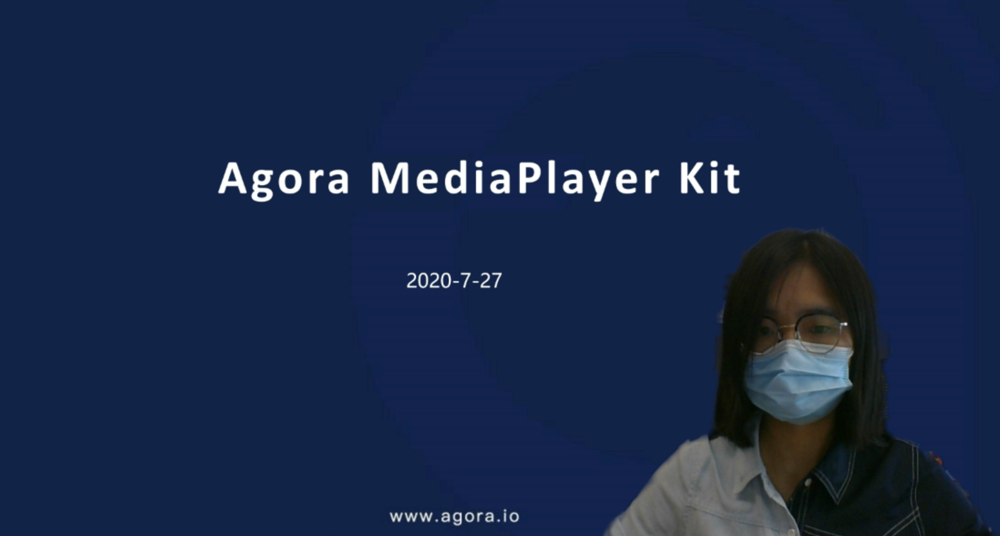

# Virtual Background

Virtual Background enables users to blur their background or replace it with a solid color or an image. This feature is applicable to scenarios such as online conferences, online classes, and live streaming. It helps protect personal privacy and reduces audience distraction.

Agora virtual background extension has the following features:

|  Feature  |  Example |
| ---- | ---- |
|  Blurred background and image background   |      |

|  Feature  |  Example |
| ---- | ---- |
| Blurred background and image background   |      |
| Video/Animated background   |   <video src="https://web-cdn.agora.io/docs-files/1654508267206" poster="https://web-cdn.agora.io/docs-files/1654571689670"  controls width="100%" height="auto">Your browser does not support the <code>video</code>  element.</video>   |
| Portrait-in-picture   |  Allows the presenter to use slides as the virtual background while superimposing their video. The effect is similar to a weather news cast on television, preventing interruptions during a layout toggle.   |

Want to test <Vg k="RTEE_VB" />? Try the <a href="https://webdemo.agora.io/virtualBackground/index.html">online demo</a>.

## Full Documentation

[Agora's virtual background guide](https://docs.agora.io/en/video-calling/enable-features/virtual-background?platform=web).